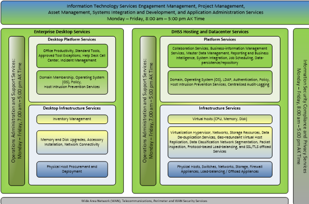

  
# Information Technology Standards Reference D 

## State of Alaska

## Department of Health and Social Services

### 1 Introduction

This document presents software, hardware and other Information
Technology product standards for Alaska Department of Health and Social
Services (DHSS). This document is a reference companion to other
documents, such as the DHSS IT RFP IT Requirements template, that
clarifies the current IT standards. This IT Standards document is
structured according to the service-line/area for the applicable
standard.

### 1.1 State of Alaska Statewide IT Standards

In addition to the DHSS IT Standards identified in this document, the
State of Alaska Department of Administration (DOA) Office of Information
Technology (OIT) may have state standards that are not represented in
this document. Please see their services website at [Home, Office of
Information Technology, State of
Alaska](https://oit.alaska.gov/home/#serviceCatalog).

### 1.2 DHSS Service Lines

The DHSS following IT service lines apply:

### 1.3 Change Log

This document is updated as needed. The following change log reflects
the person, revision date and summary of the change.

| **Author**             | **Date** | **Summary of change** |
| ------------            |:-------- | --------- |
|    S Taylor                | 2/10/2017 |Re-organized document, added change log |
|    T Kisner                | 10/16/2018 | Removed ETS reference and link to their IT Standards document |
|    C Boom                   | 09/27/2021 | Updated link to OIT services catalog website. Updated lists of standard software. Added DHSS Logo, formatted header.  Added document date and page number. |

### 2 Standards

This section contains the standards for each service-line. Standards are
established for:

-   Software

-   Hardware

-   Other IT products (e.g., other referenced standards)

Standards must be followed for all IT software, hardware and other
products. Deviation from standards requires a completed Security Policy
Waiver for each individual using the deviant product, as established by
DHSS information security policies and standard operating procedure
[SOP-Security Policy
Waiver](https://extranet.dhss.alaska.gov/its/prodsys/IT-SOP/ITS%20SOP%20Library/SOP-Security%20Policy%20Waiver.pdf).

### 2.1 Engagement and Service Delivery Management Service Standards

Engagement and Service Delivery Management Services focus on how DHSS IT
interacts with our DHSS customers, vendors, grantees and other partners.
The following standards apply.

### 2.11 Hardware

No unique hardware standards for Engagement and Service Delivery
Management Services.

### 2.1.2 Software

| **Standard**          | **Function**          | **Uses**              |
| --------------------- | ----------------------| ----------------------|
| Microsoft SharePoint 2010  Microsoft SharePoint 2019 effective 3/2022  | Enterprise Content and Document Management, Intranet and Social Network, Collaboration, Custom Web Applications and Workflow | IT Matrix Inventory of initiatives (projects, systems, services), Reference document libraries   |
| Microsoft Team Foundation Server 2018 (on prem)   Azure DevOps (SaaS) | Version control, Agile project  management, Continuous integration, Release management, Package mgmt., DevSecOps, Testing     | Service delivery management tracking and reporting      |
| SolarWinds Web Help Desk   | Help Desk Ticketing System  | Service delivery management tracking and reporting      |

### 2.1.3 Other Products

No unique other product standards for Engagement and Service Delivery
Management Services.

### 2.2 Project Portfolio Management Service Standards

Project Portfolio Management Services focus on how DHSS IT supports
project management enterprise process development and execution. The
following standards apply.

### 2.2.1 Hardware

No unique hardware standards for Project Portfolio Management Services.

### 2.2.2 Software

| **Standard**             | **Function**          | **Uses**              |
| ----------------------   | ----------------------| ----------------------|
| Microsoft SharePoint 2010 Microsoft SharePoint 2019 effective 3/2022   | Enterprise Content and Document Management, Intranet and Social Network, Collaboration, Custom Web Applications and Workflow | IT Matrix Inventory of initiatives (projects, systems, services), Project management and chartering sites, Reference document libraries, activity lists   |
| Microsoft Team Foundation Server 2018 (on prem)   Azure DevOps (SaaS) | Version control, Agile project management, Continuous integration, Release management, Package mgmt., DevSecOps, Testing     | Work management tracking and reporting      |

### 2.2.3 Other Products

No unique other product standards for Project Portfolio Management Services.

### 2.3 Asset Management Service Standards

Asset Management Services focus on how DHSS IT supports managing software licensing and other software assets. The following standards apply.

### 2.3.1 Hardware

No unique hardware standards for Asset Management Services.

### 2.3.2 Software

| **Standard**          | **Function**          | **Uses**              |
| ------------------------ | ----------| ---------- |
|Ivanti Inventory Scanner SCCM Inventory Tracking  | Software inventory scanning  | Licensing support, enterprise standards enforcement  |
| Microsoft Team Foundation Server 2018 (on prem) Azure DevOps(SaaS)   | Documentation and code management and repository  | Version control, code and documentation management. |
| IRIS / Alder         | State asset management system/reporting  | State procurement asset tagging and tracking   |
| Dell Asst Management  | Hardware wipe and recycle  | Hardware wipe and recycle  |

### 2.3.3 Other Products

No unique other product standards for Asset Management Services.

### 2.4 Systems Integration and DDI Service Standards

Systems Integration and DDI Services focus on how DHSS IT supports system architecture development, integration between DHSS systems and information system design, development and implementation. The following standards apply.

### 2.4.1 Hardware

No unique hardware standards for Systems Integration and DDI Services.

### 2.4.2 Software

 |  **Standard**   |         **Function**      |      **Uses**  |
 | --------------- | ----------------------- | ---------------- |
 | Mainstream supported Microsoft Visual Studio | Development IDE | Information systems and software development and maintenance  |
 | Microsoft Visual Studio Code | Development IDE | Information systems and software development and maintenance |
 | Supported versions of C# language | Development language | Information systems and software development and maintenance |
 | Microsoft Team Foundation Server 2018 | Work management, SDLC support | Work management, requirements definition, design, implementation and test management and execution artifacts |
 | Mainstream support versions of Microsoft Visio  | Diagramming and modeling | Diagramming and modeling various architectural views |
 | Mainstream support versions of Microsoft Powershell | Automation and DevSecOps  | Automate various processes via Powershell |
 | Mainstream support versions of .NET Framework and .NET Core (preferred) | Development language |   Information systems and software development and maintenance |
 | Microsoft Dynamics 365, on prem  | Development IDE  | Information systems and software development and maintenance |
 
### 2.4.3 Other Products
 |  **Standard**   |         **Function**      |      **Uses**  |
 | --------------- | ----------------------- | ---------------- |
 | Microsoft Azure PaaS |  Auto-scaling custom information system application containers in the cloud |  Hosting information systems and services in the cloud |

### 2.5 Systems Operations and Administration Service Standards

Systems Operations and Administration Services focus on how DHSS IT supports technical system operations and system administration. The following standards apply.

### 2.5.1 Hardware

No unique hardware standards for System Operations and Administration Services.

### 2.5.2 Software
 |  **Standard**   |         **Function**      |      **Uses**  |
 | --------------- | ----------------------- | ---------------- |
 | Microsoft Windows Remote Desktop Client, Ivanti, SCCM, VMWare vSphere, Citri Access, Gateway, Cisco AnyConnect, OpenConnect for Mainframe | Remote desktop access | Remote server access |
 | F5 Proxy Services |  Reverse proxy   | Web application delivery |
 | Mainstream support versions of Microsoft Internet Information Services Manager | System administration  | Manage IIS sites and applications |
 | Mainstream support versions of Microsoft  SQL Server Management Studio  | System administration | Manage SQL Server databases and servers |
 | Mainstream support versions of Microsoft BizTalk Server Administration Console | System administration | Manage BizTalk servers and server groups, Enterprise Service Bus (ESB)  |
 |  Mainstream support version of Visionware MultiVue Administration Console | System administration |  Manage MultiVue Configuration, Master Client Index (MCI)  |
 |  Mainstream support versions of Microsoft PowerShell | System administration  |   Manage various services via PowerShell |
                                       
### 2.5.3 Other Products
 |  **Standard**   |         **Function**      |      **Uses**  |
 | --------------- | ----------------------- | ---------------- |
 | Microsoft Azure Portal | Management for all Azure resources and services allocated with a tenant subscription  | Administering Azure hosted resources and services |

### 2.6  Information Security Compliance and Privacy Service Standards

Information Security Compliance and Privacy Services focus on how DHSS IT supports legal compliance with information security, privacy, and ongoing development/maintenance of security policy and practice. The following standards apply.

### 2.6.1 Hardware

No unique hardware standards for Information Security Compliance and Privacy Services.

### 2.6.2 Software
 |  **Standard**   |         **Function**      |      **Uses**  |
 | --------------- | ----------------------- | ---------------- |
 |  RSA Archer     | Information security risk and compliance | Risk and compliance management |
 |  Splunk         | Enterprise log indexing and reporting | Audit-logging, reporting |
 |  Veracode       | Software vulnerability scanning |  Scan source code, identify software vulnerabilities for remediation, per policy |
 |  Varonis        | Enterprise confidential data audit-logging | File system-based access audit logging |
 
### 2.6.3 Other Products
 |  **Standard**   |         **Function**      |      **Uses**  |
 | --------------- | ----------------------- | ---------------- |
 |  NIST 800-53 v4 | Standardized security controls |  Reference for security plan control set |
 |  NIST 800-66    | Standard subset of NIST  800-53 controls for HIPAA | Selection criteria for security plan control set for HIPAA systems |
 |  MARS-E 2.0     | CMS specific security controls for healthcare exchanges | Required for applicable systems with CMS approval |
                              
### 2.7 Enterprise Desktop Service Standards

Enterprise Desktop and Mobility Services focus on how DHSS IT supports defining, deploying and supporting the DHSS enterprise desktop and mobility endpoints. The following standards apply.

### 2.7.1 Hardware
|  **Standard**   |         **Function**      |      **Uses**  |
| --------------- | ----------------------- | ---------------- |
| Dell Precision 3540 Mem 32GB HD M.2 512 SSD Processor 15-11500   | PC workstation        | Desktop, non-mobile   |
| Dell Precision 3650 Mem 32GB HD M.2 512 SSD Processor i7   | PC workstation        | Power Desktop, non-mobile   |
| Dell Latitude 5310 Mem 16GB HD M.2 256 SSD Proc i5-1021OU  | PC workstation        | Small Laptop, mobile  |
| Dell Precision M3551 Mem 32GB HD M.2 512 SSD Proc i7  | PC workstation        | Regular Laptop, mobile     |
| Dell Precision M7750 Mem 32GB HD M.2 512 SSD  Proc i7  | PC workstation        | Large Laptop, mobile  |
| Dell Latitude 7210 2 in 1 Mem 16 GB HD M.2 256 SSD Proc i5  | Mobile endpoint  | Productivity capable, extended use mobile device |
| Dell WD19DC Docking Station  | Docking station       | 17" laptops           |
| Dell WD19TBS Docking Station | Docking station       | Less than 17" laptops |

### 2.7.2 Software
|  **Standard**   |         **Function**      |      **Uses**  |
| --------------- | ----------------------- | ---------------- |
|  Microsoft Systems Center Configuration Manager (SCCM) |  Systems management   |   Desktop deployment |
|  Ivanti          |   Systems management      Desktop software install, upgrage, patching, security scanning |
|  SolarWinds Web Help Desk | Help Desk Ticketing | Incident and service request management. Interface between customers using DHSS systems/IT services and the operational support team for those systems/IT services  |
| Mainstream supported Microsoft Windows on Desktops | Desktop operating system (OS)  | Standard DHSS desktop operating system |
| Microsoft BitLocker |    Disk encryption   |        Fixed and removable disk encryption |
| Cybereason    |      Antivirus, host intrustion prevention, policy management | Antivirus, host intrusion prevention, policy management |
| Microsoft Edge current version Chrome (current version) Firefox (current version). Browser support only |  Web browser  | Browsing web |
| Minimum Browser compatibility support by DHSS is Edge in ie-11 compatibility mode  | Web-application client  | DHSS IT internal application development browser. IE 11 mode is deprecated and not preferred. Must have plans to update to modern browser compatibility |
| Microsoft Office 365 | Desktop productivity suite |  Document authoring, spreadsheets, presentations, information system integration (e.g. notice processing or other document merge processing)  |
 
### 2.7.3 Other Products

No unique other product standards for Enterprise Desktop Services.

### 2.8 DHSS Hosting and Datacenter Service Standards

DHSS Hosting and Datacenter Service Standards focus on how DHSS IT supports designing, implementing and operating standard infrastructure and platform offerings. The following standards apply.

### 2.8.1 Hardware
|  **Standard**   |         **Function**      |      **Uses**  |
| --------------- | ----------------------- | ---------------- |
|  Cisco UCS Blade Server |  Physical host  |  Datacenter virtualization resources  |
|  Dell PowerEdge Server  |  Physical host  |  Datacenter virtualization resources or remote location physical server |
|  NetApp Storage Area Network | Enterprise storage | Datacenter disk storage |
|  Checkpoint Firewall    |  Data center firewall/IPS  |  Data center protection against unauthorized access |

### 2.8.2 Software
|  **Standard**   |         **Function**      |      **Uses**  |
| --------------- | ----------------------- | ---------------- |
|  F5             |  Load balancing, proxy, protocol optimization, SSL/TLS offload appliance |  Load balancing, SSL/TLS offload |
| VMWare ESXi Hypervisor Virtualization |  Hypervisor   | Datacenter hypervisor for host virtualization |
| NFS for VMware Network  Attached Storage (NAS) |  Storage management protocol | Allocate/manage/use storage, printers, etc |
| iSCSI for VMware Storage Area Network (SAN) |  Storage management protocol |   Allocate/manage/use storage |
| Mainstream supported Microsoft Windows Server |  Server operating system | Access and manage server hosts |
| Mainstream supported Microsoft .NET |  Underlying enterprise services platform API | Support 3rd party and custom .NET components and services |
| .NET Core   | Underlying enterprise services platform API |   Support 3rd party and custom .NET Core components and services |
| Mainstream supported Microsoft Active Directory | Domain, LDAP, authentication, policy | Manage domain, LDAP, authentication (Kerberos, Integrated) and policy |
| Mainstream supported Microsoft Active Directory Federation Services |   Federated authentication | Manage authentication in federated identity scenarios |
| Mainstream supported Microsoft SQL Server | Information persistence/data repository |  Online Transaction Processing/Information system database storage |
| Splunk  |   Enterprise log indexing and reporting | Audit-logging, reporting |
| Mainstream Microsoft Internet Information Services |  Application server and web content delivery |  Support IIS hosted applications and content |
| Mainstream supported Microsoft SQL Server Reporting Services |   Reporting and business intelligence |  Report authoring, scheduling, and subscription services |
| Mainstream supported Microsoft SQL Server Analysis Services  |   Reporting and business intelligence |  Online Analytical Processing/Information and metrics trend reporting |
| Mainstream supported Microsoft Sharepoint 2019  | Enterprise Content and Document Management, Intranet and Social Network, Collaboration, Custom Web Applications and Workflow  | Collaborative self-service business productivity, including: intranet, document libraries, simple data lists and simple workflows. Approved applications |
| Mainstream supported Microsoft BizTalk |  System integration, Enterprise Service Bus(ESB) |  Master Client Index, line of business system integration |
| Mainstream supported version Microsoft Dynamics CRM, on prem |  Extensible relationship/case management, rapid design and scalable business information systems platform |  Case management, registries, grants management |
| Mainstream supported version Visionware MultiVue |  Master data management | Master Client Index |
| DHSS Master Client Index | Line of business system client cross-reference | System integration support, Client Services Dashboard |

### 2.8.3 Other Products
|  **Standard**   |         **Function**      |      **Uses**  |
| --------------- | ----------------------- | ---------------- |
| Microsoft Azure PaaS | Auto-scaling custom information system application containers in the cloud | Hosting information systems and services in the cloud |

### 2.9 DHSS Wide Area Network, Telecommunications and Perimeter and WAN Security Service Standards

DHSS Wide Area Network, Telecommunications and Perimeter Security Services focus on how DHSS IT supports integrating the DHSS LAN with the State of Alaska (SOA) wide area network, telecommunications and perimeter security managed by Department of Administration (DOA) Office of Information Technology (OIT). The following standards apply.

### 2.9.1 Hardware

No unique hardware standards for DHSS Wide Area Network, Telecommunications and Perimeter Security Services.

### 2.9.2 Software
|  **Standard**   |         **Function**      |      **Uses**  |
| --------------- | ----------------------- | ---------------- |
| Service Desk Manager(SDM) AKNow (ServiceNow)  | Incident and service request management tracking  | Interface between DHSS and OIT for addressing OIT supported service incidents and requesting changes and other services     |

### 2.9.3 Other Products
|  **Standard**   |         **Function**      |      **Uses**  |
| --------------- | ----------------------- | ---------------- |
|  PureCloud      | Interactive Voice Response |     Cloud call center solution |
 
